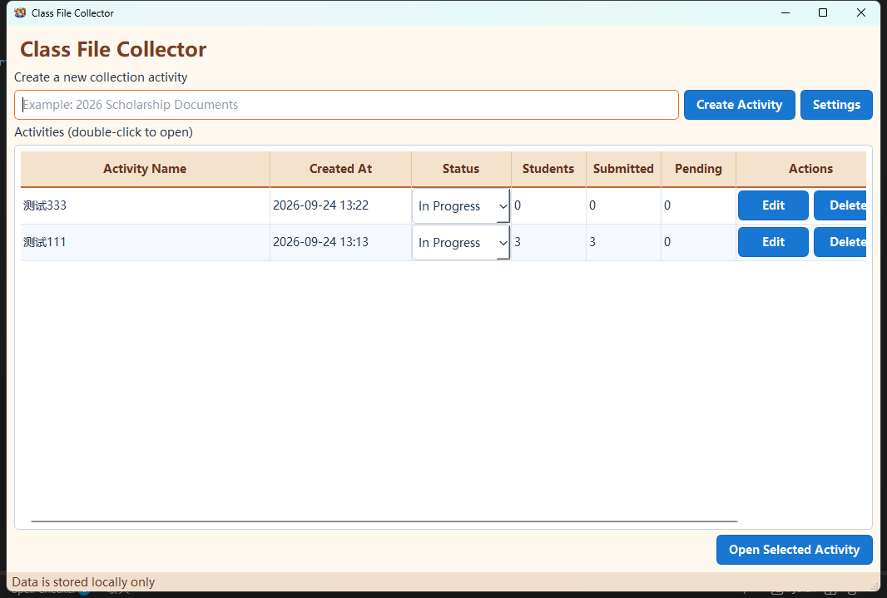
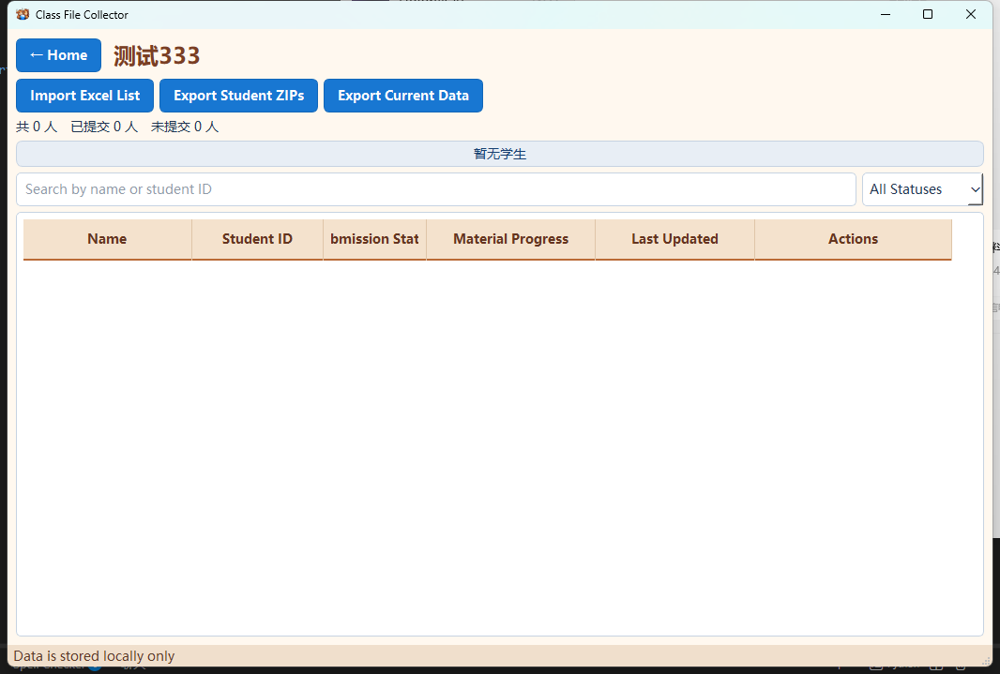
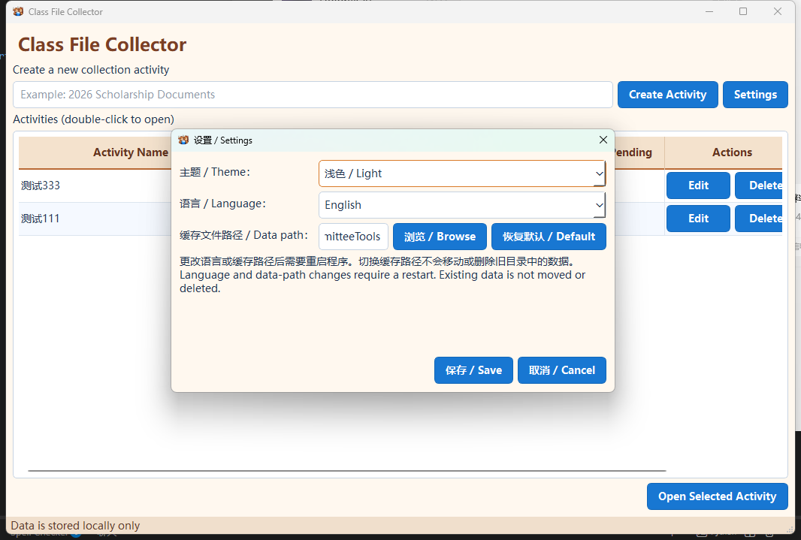

# 材料收集工具

一个使用 Python 和 PyQt6 编写的本地桌面工具，可创建材料收集活动、从 Excel
导入学生名单、归档学生材料，并按学生姓名生成 ZIP 压缩包。

导出时会先创建以活动名称命名的文件夹，再将各学生的独立 ZIP 压缩包放入其中：

```text
选择的输出目录/
└─ 活动名称/
   ├─ 张三.zip
   ├─ 李四.zip
   └─ ...
```

## 界面预览

### 主页



### 材料收集页



### 设置



## 运行环境

- Python 3.10.6 或更高版本（推荐使用 Conda 环境 `py3106`）
- Windows 10/11（开发阶段也可在其他桌面系统运行）

## 本地运行

```powershell
conda activate py3106
python -m pip install -r requirements.txt
python main.py
```

应用数据默认保存在当前用户的本地应用数据目录 `ClassCommitteeTools` 中。学生材料只在
本机处理，不会上传网络。

## Excel 名单格式

使用 `.xlsx` 文件，第一行必须包含以下任一姓名列标题：

- `姓名`
- `学生姓名`
- `名字`

可选的学号列标题为 `学号`、`学生学号` 或 `编号`。建议使用文本格式保存学号，避免
前导零丢失。

## 材料清单

创建活动时可以添加需要收取的材料名称，并为每项材料设置“必须提交”或“选交”。添加
学生文件时先选择对应材料类型。只有必交材料参与完成状态判断，选交材料未上传不会影响
学生显示为已完成提交。

选择材料类型后，应用内部副本和 ZIP 内文件会使用“材料类型名 + 原扩展名”，例如
`张三最终版.docx` 选择“申请表”后保存为 `申请表.docx`。学生提交的原文件不会被修改。

学生列表中的“导出当前数据”可以把当前搜索、筛选和排序结果保存为 `.xlsx`。导出前可
选择统计字段，默认全部选择；该文件只包含统计数据，不附带或链接学生材料。

## 应用设置

主页的“设置”可切换浅色/深色主题、简体中文/English，并可修改本地数据缓存路径。主题
立即生效；语言和缓存路径在重启后生效。更改缓存路径不会自动移动或删除旧目录的数据，
需要旧活动时可重新选择原缓存目录。

## 运行测试

```powershell
python -m pip install -r requirements-dev.txt
python -m pytest
ruff check .
```

## 打包 EXE

```powershell
python -m pip install -r requirements-dev.txt
pyinstaller packaging/class_committee_tools.spec
```

打包结果位于 `dist/ClassCommitteeTools/`。发布前应在未安装 Python 的 Windows 10/11
电脑上验证启动、Excel 导入、材料添加和 ZIP 导出功能。

生成包含全部依赖的单文件发布版：

```powershell
pyinstaller --noconfirm --clean --distpath dist/release packaging/class_committee_tools_onefile.spec
```

发布产物为 `dist/release/ClassCommitteeTools.exe`，无需附带 `_internal` 文件夹。PyInstaller
单文件程序运行时会自动将内部依赖解压到系统临时目录。

## 作者与联系

- 企鹅号：`1336957191`
- 如有使用问题或功能需求，欢迎联系。

## 许可证

项目计划采用 GNU General Public License v3.0 or later。正式公开仓库前请在根目录加入
完整的 `LICENSE` 文件。
